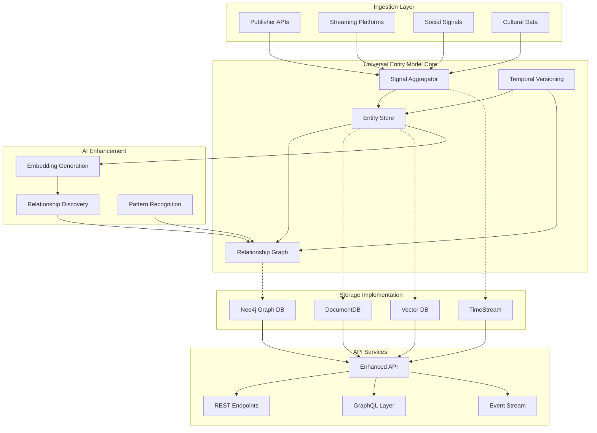
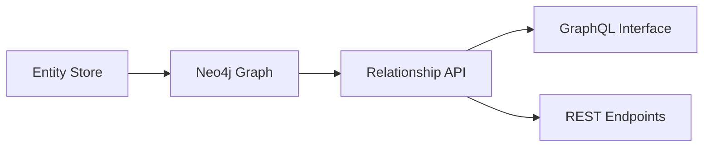
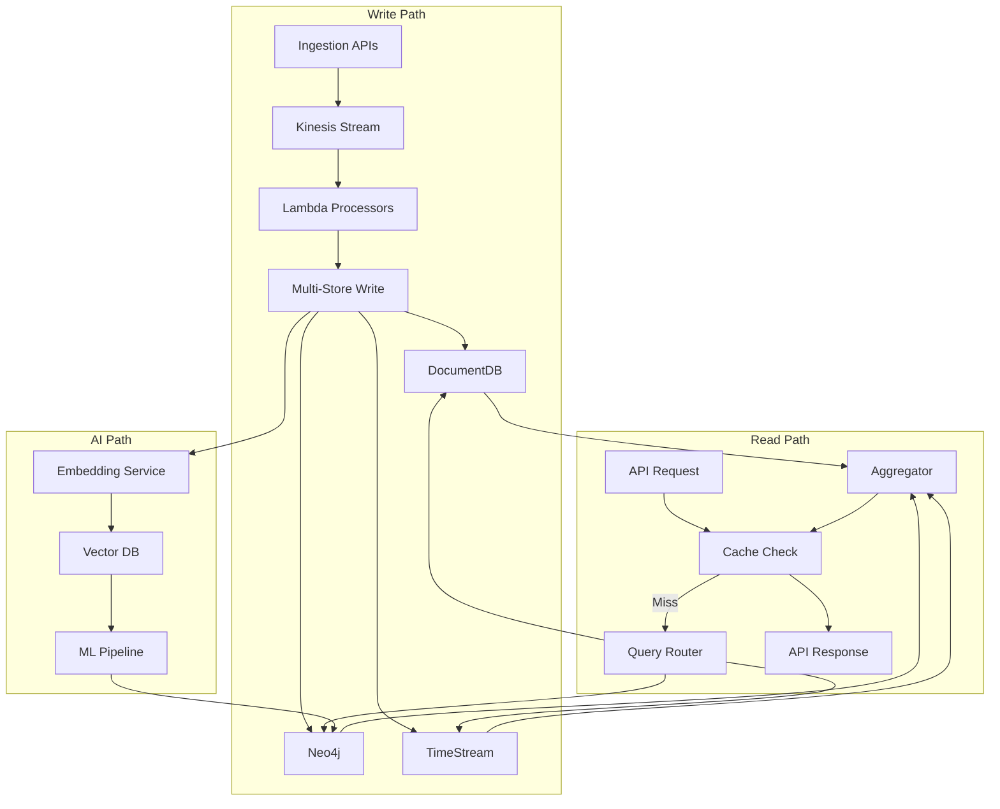
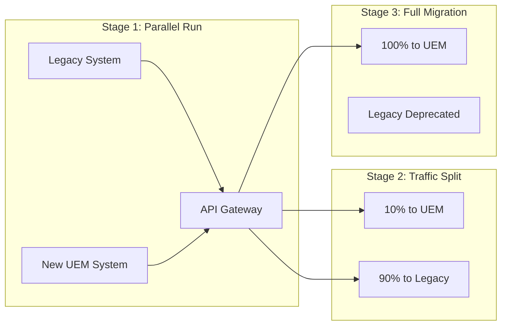

# United Tribes Data Model Architecture v2
## Universal Entity Model for Cross-Media Intelligence

*Architecture Document for Technical Review*

---

## 1. System Architecture Overview

### Current System Components

```mermaid
graph TB
    subgraph "Data Sources"
        DS1[S3 Knowledge Graph]
        DS2[Rights-Holder APIs]
        DS3[Signal Collectors]
    end

    subgraph "Current API Layer"
        API[API Gateway]
        API --> EP1[POST /v1/query]
        API --> EP2[POST /v2/broker]
        API --> EP3[GET /entities]
        API --> EP4[GET /entities/{name}]
    end

    subgraph "Processing"
        L1[Lambda Functions]
        L2[Glue Jobs]
        L3[Athena Queries]
    end

    subgraph "Storage"
        S1[S3 Data Lake]
        S2[DynamoDB Metadata]
    end

    DS1 --> L2
    DS2 --> L1
    DS3 --> L1
    L1 --> S1
    L2 --> S1
    L3 --> S1
    S1 --> API
    S2 --> API
```

### Target Architecture with Universal Entity Model



---

## 2. Universal Entity Model Specification

### 2.1 Core Entity Structure

```json
{
  "entity": {
    "id": "ut:entity:uuid-v4",
    "fingerprint": "sha256:content_hash",
    "primary_type": "CREATIVE_WORK | PERSON | ORGANIZATION | CONCEPT | EVENT",
    "subtype": "book | album | podcast_episode | podcast_series | film | tv_series | article | artwork",

    "identity": {
      "canonical_name": "Dune",
      "display_name": "Dune (1965 Novel)",
      "aliases": ["Dune Chronicles Book 1", "Arrakis"],
      "identifiers": {
        "isbn": ["978-0441172719"],
        "isrc": [],
        "isan": [],
        "doi": [],
        "proprietary": "ut:book:dune:1965"
      }
    },

    "attributes": {
      "core": {
        "created_date": "1965-06-01",
        "modified_date": "2024-01-15",
        "creator_ids": ["ut:person:frank-herbert"],
        "language": ["en"],
        "country_of_origin": "US",
        "status": "ACTIVE | DEPRECATED | MERGED"
      },

      "domain_specific": {
        // Flexible JSON schema per subtype
        "book": {
          "page_count": 688,
          "edition": "first",
          "genre": ["science_fiction", "epic"],
          "series": {
            "name": "Dune Chronicles",
            "position": 1
          }
        }
      },

      "computed": {
        "influence_score": 0.98,
        "cultural_impact": 0.95,
        "cross_media_reach": 0.89,
        "embedding_version": "v2.1",
        "last_computed": "2024-01-15T10:30:00Z"
      },

      "extensible": {
        // Future attributes without schema changes
      }
    },

    "metadata": {
      "source": "publisher_api",
      "ingested_at": "2024-01-15T09:00:00Z",
      "last_updated": "2024-01-15T10:30:00Z",
      "update_frequency": "daily",
      "data_quality_score": 0.92,
      "authorization": {
        "type": "licensed",
        "holder": "Penguin Random House",
        "terms": "full_access"
      }
    }
  }
}
```

### 2.2 Relationship Model

```json
{
  "relationship": {
    "id": "ut:rel:uuid-v4",
    "source_id": "ut:entity:book:dune",
    "target_id": "ut:entity:film:dune-2021",
    "relationship_class": "CREATIVE_LINEAGE",
    "relationship_type": "adapted_to",

    "properties": {
      "weight": 1.0,
      "confidence": 0.95,
      "fidelity": "faithful",
      "temporal_distance_years": 56,
      "metadata": {
        "rights": "Warner Bros",
        "director": "Denis Villeneuve"
      }
    },

    "evidence": {
      "type": "direct",
      "sources": ["publisher_confirmation", "imdb_data"],
      "extracted_by": "human_curation",
      "validated": true
    },

    "temporal": {
      "created_at": "2021-10-22",
      "relationship_start": "2016-01-01",
      "relationship_end": null,
      "is_current": true
    }
  }
}
```

### 2.3 Relationship Taxonomy

```yaml
relationship_classes:
  CREATIVE_LINEAGE:
    types:
      - adapted_to: {weight_range: [0.3, 1.0], bidirectional: true}
      - inspired_by: {weight_range: [0.1, 0.8], directional: true}
      - sequel_to: {weight_range: [1.0, 1.0], directional: true}
      - reimagined_as: {weight_range: [0.2, 0.6], bidirectional: true}
      - influenced: {weight_range: [0.1, 0.7], directional: true}

  THEMATIC_CONNECTION:
    types:
      - shares_theme: {weight_range: [0.1, 1.0], bidirectional: true}
      - explores_concept: {weight_range: [0.2, 0.9], bidirectional: true}
      - similar_mood: {weight_range: [0.1, 0.8], bidirectional: true}
      - opposing_view: {weight_range: [0.3, 0.7], bidirectional: true}

  AUDIENCE_BRIDGE:
    types:
      - consumed_together: {weight_range: [0.1, 1.0], bidirectional: true}
      - recommended_after: {weight_range: [0.2, 0.9], directional: true}
      - gateway_to: {weight_range: [0.3, 0.8], directional: true}
      - demographic_overlap: {weight_range: [0.1, 1.0], bidirectional: true}

  PRODUCTION_NETWORK:
    types:
      - same_creator: {weight_range: [1.0, 1.0], bidirectional: true}
      - shared_talent: {weight_range: [0.3, 1.0], bidirectional: true}
      - same_publisher: {weight_range: [0.5, 1.0], bidirectional: true}
      - distribution_partner: {weight_range: [0.4, 0.8], bidirectional: true}

  TEMPORAL_PATTERN:
    types:
      - preceded_by: {weight_range: [1.0, 1.0], directional: true}
      - contemporary_with: {weight_range: [0.5, 1.0], bidirectional: true}
      - revival_of: {weight_range: [0.3, 0.8], directional: true}
      - predicted_by: {weight_range: [0.2, 0.7], directional: true}
```

### 2.4 Signal Aggregation Model

```json
{
  "signals": {
    "entity_id": "ut:entity:book:dune",
    "signal_type": "CONSUMPTION | ENGAGEMENT | COMMERCIAL | CULTURAL",

    "consumption_signals": {
      "reads": {
        "total": 1250000,
        "period": "all_time",
        "trend": "+12%",
        "sources": ["goodreads", "amazon", "library_systems"]
      },
      "completion_rate": 0.73,
      "reread_rate": 0.15,
      "time_to_finish_avg_days": 7.2,
      "format_breakdown": {
        "print": 0.45,
        "ebook": 0.35,
        "audio": 0.20
      }
    },

    "engagement_signals": {
      "ratings": {
        "weighted_average": 4.3,
        "platforms": {
          "goodreads": {"score": 4.2, "count": 450000},
          "amazon": {"score": 4.5, "count": 125000}
        }
      },
      "sentiment": {
        "positive": 0.82,
        "neutral": 0.12,
        "negative": 0.06
      },
      "discussion_volume": {
        "reddit_posts": 3400,
        "twitter_mentions": 45000,
        "blog_articles": 890
      }
    },

    "temporal_signals": {
      "captured_at": "2024-01-15T10:00:00Z",
      "period_start": "2024-01-01",
      "period_end": "2024-01-15",
      "confidence": 0.92,
      "completeness": 0.88
    }
  }
}
```

### 2.5 Temporal Versioning Model

```json
{
  "temporal_entity": {
    "entity_id": "ut:entity:band:beatles",
    "timeline": [
      {
        "version_id": "v1",
        "period_start": "1960-08-01",
        "period_end": "1962-12-31",
        "phase_name": "Hamburg Era",

        "attributes_snapshot": {
          "members": ["lennon", "mccartney", "harrison", "best"],
          "style": ["rock_and_roll", "covers"],
          "label": "parlophone"
        },

        "relationships_active": [
          {
            "type": "influenced_by",
            "targets": ["chuck_berry", "little_richard"],
            "weight": 0.9
          }
        ],

        "metrics": {
          "popularity_index": 0.15,
          "influence_score": 0.20
        }
      },
      {
        "version_id": "v2",
        "period_start": "1963-01-01",
        "period_end": "1966-12-31",
        "phase_name": "Beatlemania",

        "attributes_snapshot": {
          "members": ["lennon", "mccartney", "harrison", "starr"],
          "style": ["pop_rock", "merseybeat"],
          "label": "parlophone"
        },

        "relationships_active": [
          {
            "type": "influenced",
            "targets": ["rolling_stones", "the_who", "kinks"],
            "weight": 0.85
          }
        ],

        "metrics": {
          "popularity_index": 0.98,
          "influence_score": 0.75
        }
      }
    ],

    "transition_events": [
      {
        "date": "1962-08-16",
        "event": "Pete Best replaced by Ringo Starr",
        "impact": "HIGH"
      }
    ]
  }
}
```

---

## 3. Implementation Phases

### Phase 0: Where We've Come From (Completed)
**Timeline: Past 6 months**

**Achievements:**
- Built initial S3-based knowledge graph
- Implemented basic entity search via Athena
- Created v1 API with query and broker endpoints
- Established relationships with initial rights-holders

**Current State:**
```
- Entities: ~100K (mostly unstructured)
- Relationships: Basic genre/creator links
- API: RESTful, single-media queries
- Storage: S3 + DynamoDB
```

### Phase 1: Foundation (Months 1-3)
**Goal:** Establish Universal Entity Model structure

**Deliverables:**
1. Define entity schemas for books, music, podcasts, films
2. Migrate existing data to new model
3. Implement DocumentDB for entity storage
4. Create data ingestion pipelines

**Technical Tasks:**
```python
# Migration script example
def migrate_to_uem():
    # Extract from S3
    legacy_entities = s3_client.get_objects('legacy-bucket')

    # Transform to UEM
    for entity in legacy_entities:
        uem_entity = {
            'id': generate_uuid(),
            'fingerprint': hash_content(entity),
            'primary_type': map_legacy_type(entity),
            'attributes': transform_attributes(entity)
        }

    # Load to DocumentDB
    docdb_client.bulk_insert(uem_entities)
```

### Phase 2: Relationship Graph (Months 4-6)
**Goal:** Implement comprehensive relationship system

**Deliverables:**
1. Deploy Neo4j for relationship storage
2. Build relationship discovery pipeline
3. Create graph traversal APIs
4. Implement relationship taxonomy

**Architecture Changes:**


### Phase 3: AI Enhancement (Months 7-9)
**Goal:** Add intelligence layer

**Deliverables:**
1. Implement embedding generation for all entities
2. Deploy vector database for similarity search
3. Build AI relationship discovery pipeline
4. Create pattern recognition system

**AI Pipeline:**
```python
class AIEnhancement:
    def __init__(self):
        self.embedder = SentenceTransformer('all-mpnet-base-v2')
        self.llm = Bedrock('claude-3-sonnet')
        self.vector_db = Pinecone('ut-embeddings')

    def process_entity(self, entity):
        # Generate embeddings
        text = f"{entity.name} {entity.description}"
        embedding = self.embedder.encode(text)

        # Store in vector DB
        self.vector_db.upsert(entity.id, embedding)

        # Find similar entities
        similar = self.vector_db.query(embedding, top_k=50)

        # LLM validates relationships
        for candidate in similar:
            relationship = self.discover_relationship(entity, candidate)
            if relationship.confidence > 0.7:
                self.graph.add_relationship(relationship)
```

### Phase 4: Temporal & Signals (Months 10-12)
**Goal:** Add time-based intelligence and signal processing

**Deliverables:**
1. Implement temporal versioning system
2. Deploy TimeStream for signal storage
3. Build signal aggregation pipelines
4. Create trend detection algorithms

**Signal Processing:**
```yaml
signal_pipeline:
  sources:
    - goodreads_api: ratings, reviews, shelves
    - spotify_api: playlist_inclusions, play_counts
    - social_media: mentions, discussions

  processing:
    - normalize_scores: 0-1 scale
    - weight_by_source: reliability factors
    - aggregate: rolling_windows
    - detect_anomalies: spike_detection

  storage:
    - timestream: time_series_data
    - documentdb: aggregated_metrics
    - s3: raw_signals_archive
```

### Phase 5: Platform Evolution (Months 13-18)
**Goal:** Full production platform

**Deliverables:**
1. Scale to 10M+ entities
2. Process 1B+ relationships
3. Real-time signal processing
4. Multi-tenant platform capabilities

**Target Metrics:**
```
Entities: 10M+
Relationships: 1B+
Daily Signal Updates: 100M
API Response Time: <200ms p95
Relationship Discovery: 10K/day
Platform Partners: 50+
```

---

## 4. Data Storage Strategy

### 4.1 Storage Layer Selection

| Data Type | Storage Solution | Rationale |
|-----------|-----------------|-----------|
| Entities | DocumentDB | Flexible schema, complex queries |
| Relationships | Neo4j | Graph traversal optimization |
| Embeddings | Pinecone/Weaviate | Vector similarity search |
| Signals | TimeStream | Time-series optimization |
| Raw Data | S3 | Cost-effective archive |
| Cache | ElastiCache | Sub-10ms responses |
| Search Index | OpenSearch | Full-text search |

### 4.2 Data Flow Architecture



---

## 5. API Evolution

### 5.1 Current API Structure
```
/v1/query - Simple text search
/v2/broker - Creative intelligence analysis
/entities - Basic entity listing
/entities/{name} - Entity details
```

### 5.2 Target API Structure

**REST Endpoints:**
```
# Entity Operations
GET  /v3/entities/{id}
GET  /v3/entities/{id}/versions
GET  /v3/entities/{id}/relationships?depth=2&type=thematic
GET  /v3/entities/{id}/signals?period=30d

# Relationship Operations
GET  /v3/relationships/{id}
POST /v3/relationships/discover
GET  /v3/relationships/traverse

# Discovery Operations
POST /v3/discover/similar
POST /v3/discover/recommend
POST /v3/discover/path?from={id}&to={id}

# Signal Operations
GET  /v3/signals/trending?media_type=book&period=7d
GET  /v3/signals/entity/{id}/timeline
```

**GraphQL Schema:**
```graphql
type Entity {
  id: ID!
  type: EntityType!
  name: String!
  attributes: JSON
  relationships(
    types: [RelationType]
    depth: Int
    minWeight: Float
  ): [Relationship]
  signals(
    period: String
    type: SignalType
  ): [Signal]
  versions: [TemporalVersion]
}

type Relationship {
  id: ID!
  source: Entity!
  target: Entity!
  type: RelationType!
  weight: Float!
  evidence: [Evidence]
  temporal: TemporalData
}

type Query {
  entity(id: ID!): Entity
  discover(
    input: DiscoveryInput!
  ): DiscoveryResult!
  traverse(
    from: ID!
    to: ID!
    maxDepth: Int
  ): [Path]
}
```

---

## 6. Migration Strategy

### 6.1 Zero-Downtime Migration Plan



### 6.2 Data Migration Pipeline

```python
# ETL Pipeline for Migration
class DataMigration:
    def __init__(self):
        self.legacy_store = S3Client()
        self.new_store = DocumentDBClient()
        self.validator = DataValidator()

    def migrate_batch(self, batch_id):
        # Extract
        legacy_data = self.legacy_store.get_batch(batch_id)

        # Transform
        uem_entities = []
        for item in legacy_data:
            entity = self.transform_to_uem(item)
            if self.validator.validate(entity):
                uem_entities.append(entity)

        # Load
        self.new_store.bulk_insert(uem_entities)

        # Verify
        self.verify_migration(batch_id)

    def transform_to_uem(self, legacy_item):
        return {
            'id': self.generate_id(legacy_item),
            'fingerprint': self.hash_content(legacy_item),
            'primary_type': self.map_type(legacy_item),
            'attributes': self.extract_attributes(legacy_item),
            'metadata': self.build_metadata(legacy_item)
        }
```

---

## 7. Performance Considerations

### 7.1 Query Optimization Strategies

```python
# Caching Strategy
cache_config = {
    'entity_cache': {
        'ttl': 3600,  # 1 hour
        'max_size': '10GB'
    },
    'relationship_cache': {
        'ttl': 1800,  # 30 minutes
        'max_size': '20GB'
    },
    'query_result_cache': {
        'ttl': 300,  # 5 minutes
        'max_size': '5GB'
    }
}

# Query Optimization
class QueryOptimizer:
    def optimize_graph_traversal(self, query):
        # Use materialized paths for common traversals
        if query.is_common_pattern():
            return self.use_materialized_view(query)

        # Limit depth for exploration queries
        if query.depth > 3:
            return self.paginated_traversal(query)

        # Parallel execution for multiple paths
        if query.has_multiple_targets():
            return self.parallel_execution(query)
```

### 7.2 Scalability Targets

| Metric | Current | Target | Strategy |
|--------|---------|--------|----------|
| Entities | 100K | 10M+ | Sharded DocumentDB |
| Relationships | 1M | 1B+ | Distributed Neo4j |
| QPS | 100 | 10,000 | Multi-region deployment |
| Latency p95 | 500ms | 200ms | Aggressive caching |
| Signal Updates | Daily | Real-time | Kinesis streams |

---

## 8. Next Steps

1. **Immediate (Week 1-2):**
   - Review and approve data model structure
   - Begin DocumentDB setup
   - Start migration script development

2. **Short-term (Month 1):**
   - Deploy Phase 1 infrastructure
   - Migrate 10K entities as proof of concept
   - Build initial ingestion pipelines

3. **Medium-term (Quarter 1):**
   - Complete Phase 1-2
   - Launch relationship graph
   - Begin AI enhancement development

4. **Long-term (Year 1):**
   - Full platform deployment
   - 10M+ entities indexed
   - Production API serving partners

---

## 9. Key Decisions & Discussion Points

### 9.1 Data Model Decisions

**Entity Granularity**
- [ ] Should we treat different editions/versions of a book as separate entities or versions of one entity?
- [ ] How do we handle compilations (albums, anthologies, box sets)?
- [ ] Should podcast episodes be entities separate from podcast series?
- [ ] Do we create entities for chapters/tracks/segments, or keep atomic at work level?

**Identity & Deduplication**
- [ ] What constitutes entity uniqueness (title + creator + year vs. ISBN/ISRC)?
- [ ] How do we handle translated works - same entity or linked entities?
- [ ] What's our merge strategy when we discover duplicates?
- [ ] Should we maintain merge history for reversibility?

**Relationship Philosophy**
- [ ] Do we allow inferred relationships or require evidence?
- [ ] What's the minimum confidence threshold for AI-discovered relationships?
- [ ] Should relationships decay over time without reinforcement?
- [ ] How many relationship types is too many (complexity vs expressiveness)?

### 9.2 Technical Architecture Choices

**Storage Technology Stack**
- [ ] Neo4j vs Neptune vs ArangoDB for graph storage?
- [ ] DocumentDB vs DynamoDB vs MongoDB for entity storage?
- [ ] Pinecone vs Weaviate vs Qdrant for vector storage?
- [ ] Build vs buy for signal processing infrastructure?

**Scalability vs Complexity**
- [ ] Start with managed services (higher cost) or self-hosted (more control)?
- [ ] Monolithic graph or federated subgraphs by media type?
- [ ] Single global deployment or multi-region from start?
- [ ] Real-time updates or batch processing for relationships?

**API Design Philosophy**
- [ ] REST-first, GraphQL-first, or equal priority?
- [ ] How much intelligence in the API vs client-side?
- [ ] Versioning strategy - URL, header, or query parameter?
- [ ] Rate limiting by calls, data volume, or compute cost?

### 9.3 Business Model Impacts

**Data Access Tiers**
- [ ] What data is free tier vs premium (entities, relationships, signals)?
- [ ] Should we limit graph traversal depth by tier?
- [ ] Is AI-discovered content premium only?
- [ ] Do we charge differently for different media types?

**Rights & Privacy**
- [ ] How do we handle GDPR/CCPA for person entities?
- [ ] What data requires explicit rights-holder permission?
- [ ] Can we use public social signals without agreement?
- [ ] Should we watermark or track data usage?

### 9.4 Data Quality Standards

**Accuracy vs Coverage**
- [ ] Is it better to have 1M high-quality entities or 10M varying quality?
- [ ] What's the minimum data completeness to publish an entity?
- [ ] Should we show confidence scores in API responses?
- [ ] How do we handle controversial or disputed information?

**Human vs AI Curation**
- [ ] What requires human validation before publishing?
- [ ] How do we blend authoritative sources with crowd wisdom?
- [ ] Should AI-generated relationships be marked differently?
- [ ] What's our fact-checking and correction process?

### 9.5 Migration & Compatibility

**Breaking Changes**
- [ ] Do we maintain v1/v2 endpoints during migration?
- [ ] How long do we support legacy data formats?
- [ ] Should we auto-migrate API consumers or require updates?
- [ ] What's our deprecation timeline and communication?

**Data Preservation**
- [ ] Do we keep all historical data or implement retention policies?
- [ ] How do we handle rights-holder content removal requests?
- [ ] Should we version the entire graph or just entities?
- [ ] What's our backup and disaster recovery strategy?

### 9.6 Performance Trade-offs

**Consistency vs Speed**
- [ ] Eventual consistency acceptable for relationships?
- [ ] Cache invalidation strategy - aggressive or conservative?
- [ ] Pre-compute common queries or calculate on-demand?
- [ ] How much denormalization for performance?

**Cost Optimization**
- [ ] Which queries do we optimize for (affects storage design)?
- [ ] What's our target cost per API call?
- [ ] How aggressive should cache be vs storage costs?
- [ ] When do we archive vs delete old signals?

### 9.7 Future-Proofing

**Extensibility Planning**
- [ ] How do we handle new media types not yet invented?
- [ ] Should we design for blockchain/NFT integration now?
- [ ] What AI capabilities should we architect for?
- [ ] How do we prepare for regulation changes?

**Platform Evolution**
- [ ] Do we plan for user-generated relationships from day 1?
- [ ] Should we design for federated instances?
- [ ] How do we enable third-party relationship validators?
- [ ] What's our strategy for community contributions?

### 9.8 Success Metrics

**What Defines Success?**
- [ ] Is it entity count, relationship quality, or API usage?
- [ ] How do we measure relationship value/usefulness?
- [ ] What's more important - depth or breadth of coverage?
- [ ] Should we optimize for discovery novelty or accuracy?

**Monitoring & Observability**
- [ ] What metrics do we track from day 1?
- [ ] How do we measure data quality over time?
- [ ] What's our alerting strategy for data issues?
- [ ] How transparent are we with platform metrics?

### Discussion Framework

For each decision point, consider:
1. **Impact**: How does this affect user experience, cost, and complexity?
2. **Reversibility**: Can we change this decision later without major rework?
3. **Timeline**: Does this need deciding now or can it wait?
4. **Dependencies**: What other decisions does this unlock or block?

**Priority Decisions (Must resolve before Phase 1):**
- Entity uniqueness strategy
- Core storage technology choices
- API versioning approach
- Rights-holder data handling

**Defer-able Decisions (Can evolve):**
- Specific relationship confidence thresholds
- Cache invalidation strategies
- Tier pricing boundaries
- Community contribution mechanisms

---

*This architecture provides the foundation for United Tribes to build a truly universal cross-media intelligence platform. The phased approach ensures we can deliver value incrementally while building toward the complete vision.*